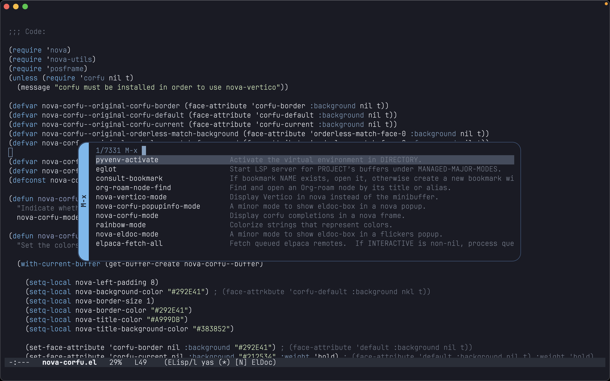
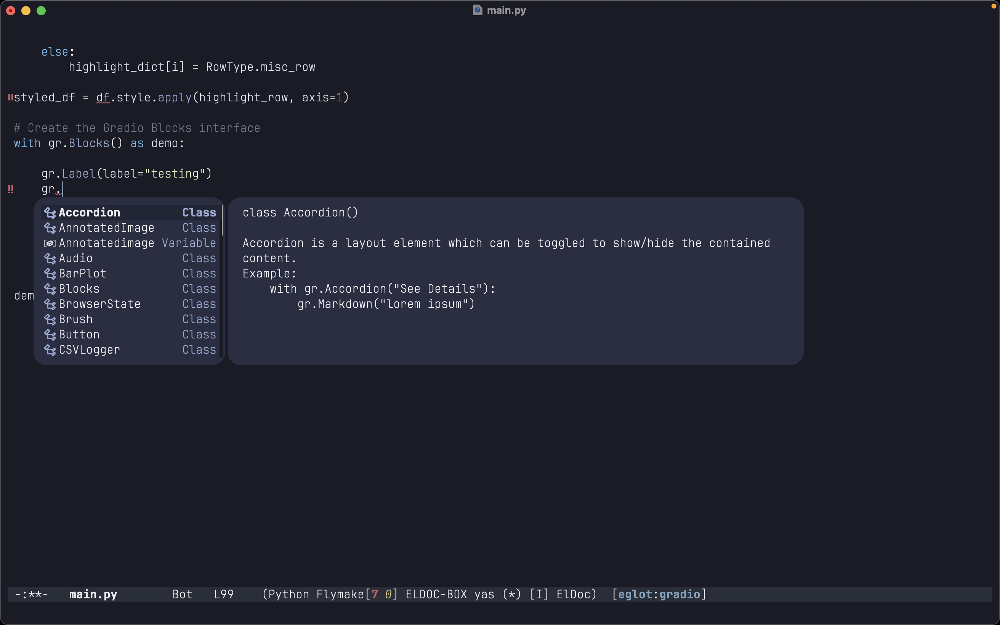
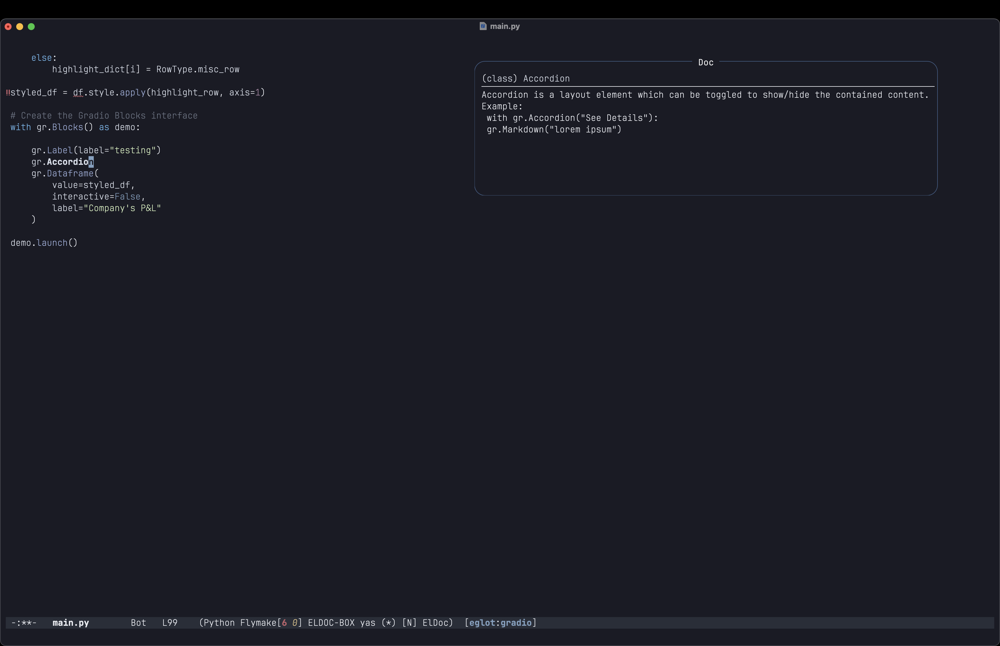

# Nova: Emacs SVG Child Frames

This is very preliminary work, nova may not work for you.
You might need to tweak the code to make it work on your screen
and font configuration.







## Overview

Nova provides a visually enhanced way to display
child frames in Emacs by leveraging an SVG-based posframe
wrapped around  (or a regular child frame).
Instead of modifying an existing child frame, this
package creates a secondary frame that draws a
customizable SVG background—complete with rounded
corners, shadows, or potentially any other decorative elements,
before placing the actual frame content on top of it.
The result is a seamless, modern-looking child frame that
integrates smoothly with your Emacs setup.

You can customize the SVG to your liking,
tailoring the shape, size, and aesthetics of your child frames without
changing how you normally interact with them.
This makes it a straightforward way to beautify tooltips,
pop-up windows, or any other child frames without
sacrificing ease of use.

Doing it this way of course means the nova frame doesn't
really have a rounded corner, but in vast majority of cases
it isn't noticeable (as it is configured to have the same
background as the main frame). To make it truly rounded, Emacs'
c code will have to be modified, maybe in the future.

## Installation

### Using Straight/Elpaca

As Nova is not on Elpa/Melpa (yet), the easiest way to install Nova
is by using straight/elpaca:

Straight:

```elisp

(straight-use-package
   '(nova :type git :host github :repo "thisisran/nova"))

```

Elpaca (with use-package integration):

```elisp

(use-package nova
  :ensure (:host github :repo "thisisran/nova"))

```

### Manual install

To install Nova manually, clone  repo and then add the necessary path:

```elisp

(add-to-list 'load-path <path_to_nova_dir>)

```

For the Nova library only:

```elisp

(require 'nova)

```

For nova-vertico (showing vertico in a floating nova frame):

```elisp

(require 'nova-vertico)

;; Then load using (nova-vertico 1)

```

For nova-corfu/nova-corfu-popupup-info (showing corfu and corfu-popupinfo in a nova frame):

```elisp

(require 'nova-corfu)
(require 'nova-corfu-popupinfo)

;; Then load using:
;; (nova-corfu 1)
;; (nova-corfu-popupinfo 1)

```

For nova-eldoc (showing eldoc-box-hover in a nova frame):

```elisp

(require 'nova-eldoc)

;; Then load using (nova-eldoc 1)

```


## Configuration

You can adjust the way the frames look by setting the following:

nova-background-color, nova-border-color, nova-border-size (1 is recommended),
nova-title-color, and nova-title-background-color. 

In addition, nova-radius-x and nova-radius-y allow you to change how round the 
corners of the frame will be. Keep in mind that this might cause the frame to
be rendered incorrectly for some values.

nova-min-height is used to give the nova frame a minimal height value. In some
cases, when wrapping a frame, because of the added decorations nova adds to a
frame, it doesn't look right when the height is too small.

nova-top-padding and nova-left-padding are used to add some padding for the top
and left side of an existing frame we are wrapping the nova frame around. This 
is useful when it seems the existing (non-nova) frame is "stepping" on top of the
nova frame, and we want to give nova more room.

nova-extra-height allows you to give extra height to the nova frame.

Each of these variables are buffer local. There is a a convenience macro, 
**nova--set-local**, to help set the variables and make sure they are set in
a buffer local context. It accepts 3 arguments:

var - the variable name you want to set.
value - the new value you want to give the variable.
name - the unique name representing the nova frame you want to set the new value for.

## Usage (users)

Once the package is loaded correctly (whether by using straight/elpaca,
or the manual install), you can use the following to enable nova with
vertico, corfu, or eldoc (more modes to come):

### nova library

nova currently supports 2 styles: **side-left** and **top-center**

side-left shows the title on the left side of the frame (as can be seen
in the nova-vertico image above). It adds some width to the frame, and
might not fit all scenarios (for example, when no title is required).

top-center shows the title at the top center of the frame. It is more
minimalistic than side-left, and also looks nice when no title is needed.

There are currently 2 functions that allow you to create a nova frame:
nova-show, and nova-show-with-posframe. nova frames are wrappers around
existing child frames (posframe or other). Sometimes you have an existing
frame you want to wrap around (such as the case with nova-vertico, nova-corfu,
and nova-eldoc), but in other cases you might just want to pop a nova frame
to display some information.

**nova-show** is used in the latter case, where you just want to popup nova
to display some inforamtion. it accepts 4 arguments (and another optional one):

name - a unique name to identify the nova frame (used for the buffer of the frame).
title - self explanatory.
style - currently nova supports either 'side-left or 'top-center.
pos-name - a unique name given to the internal posframe that will be wrapped around
by nova.
posframe-args - additional arguments to pass to the posframe function for the internal
posframe we create.


**nova-show-with-posframe** is used in cases where we have an existing posframe we want
to wrap around with nova (i.e. nova-vertico). It accepts 4 arguments:

name, title, style - same as nova-show above.

pos-frame - the existing posframe you want to wrap nova around.


In addition to nova-show and nova-show-with-posframe, the nova library 
provides the following functions:

**nova-update**: recreates the nova frame's SVG to adjust the look of the frame in
case the frame was updated (i.e. its size has changed)

**nova-delete-frame**: delete a nova frame by its name

**nova-delete-all**: deletes all nova frames

### nova-vertico

nova-vertico is similar to  (make sure to have it installed),
and relies on it, but also wraps it in a (side-left) nova frame:

```elisp

(nova-vertico-mode 1)

```

### nova-corfu/nova-corfu-popupinfo

nova-corfu (nova-corfu-popupinfo) shows corfu in-buffer completions
(or corfu-popupinfo) in a (side-left) nova frame:

```elisp

(nova-corfu 1)
(nova-corfu-popupinfo 1)

```

### nova-eldoc

nova-eldoc shows eldoc-box-hover (make sure to have eldoc installed),
in a (top-center) nova frame:

```elisp

(nova-eldoc 1)

```

## Creating new styles

 To develop a new nova style, you will need to implement 2 functions:

### nova--render--<name_of_style>

nova--render functions' job is to draw the actual SVG,
representing the frame's aesthetics.

Please look at nova--render-side-left or nova--render-top-center
(in nova-side-left.el or nova-top-center.el, accordingly) for
examples on how to accomplish that.

**Note**: make sure the coordinates you use to calculate where to
place shapes/etc. are screen agnostic, so that the frame will
be shown correctly on any screen's resolution.

nova--render functions must accept 2 arguments:

- name

  `name' is the name given to the nova frame itself, so that
  you can get the local values of the nova library's variables,
  like nova-title-color, nova-radius-x, etc. using the library's
  internal function called nova--get-local.
  
- svg-object

  `svg-object' is the svg object on which you do the actual
  SVG drawings on to (it is passed to nova--render by the
  main nova library functions.


### nova--show--<name_of_style>

nova--show functions' job is to set the posframe representing
the nova frame in correct coordinates/size.

For example, the side-left style adds a bar to the left of the
frame to show the title on the left side, and so requires a
different configuration than the top-center style, which shows
the title at the top center, without requiring any extra width
to the frame (but does require an extra height to show the title).

Please take a look at nova--show-side-left or nova--show-top-center
(in nova-side-left.el or nova-top-center.el, accordingly) for
examples on how to accomplish that.

## Known issues

- Under Mac Sequoia, with the window placements enabled, sometimes
  just moving the window causes the nova frame to stay in-spot, while
  the underlying frame moves with the window (as it should). Maximizing
  the window seems to work
